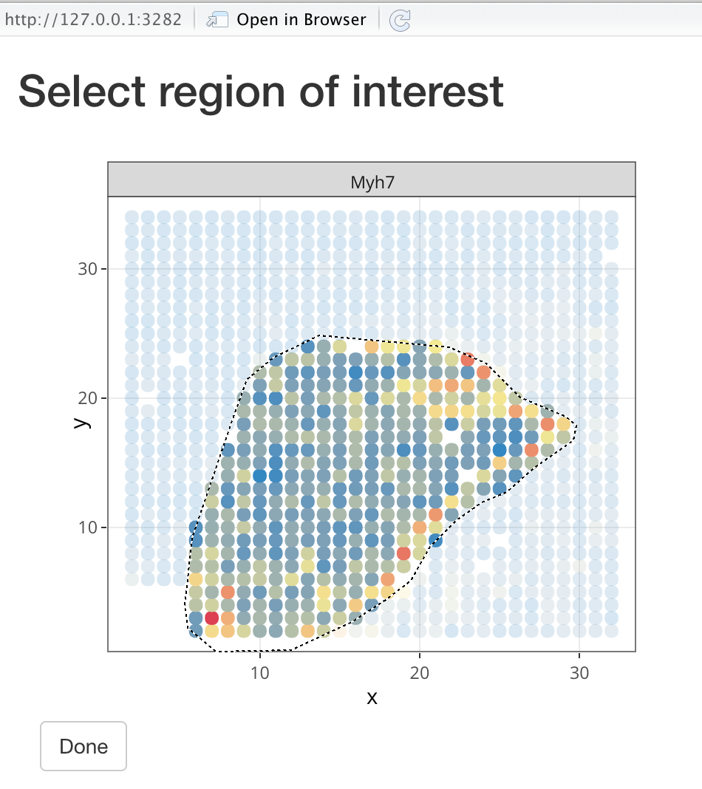

```{r setup, include=FALSE}
knitr::opts_chunk$set(echo = TRUE,
                      fig.width = 6)
```

# Background

This library was created to facilitate loading, analyzing, and viewing spatial transcriptomic data, particularly the data created by the [10XGenomics Spatial Transcriptomics Pipeline](https://www.10xgenomics.com/spatial-transcriptomics/)


# Usage

After running the pipeline on the sequencing data, a data file is generated containing expression counts for each gene (columns) as well as the x,y coordinates of each spot (rows). This data file can be loaded with the `STLoad` function. A small example dataset is provided in the package to demonstrate.

```{r}
library(telescope)
df <- system.file("extdata/stdata.tsv", package="telescope")
dat <- STLoad(df, species = "mm")
```

Note that species is either "hs" (default), or "mm". Other genomes may be added in the future.

You can then plot the expression levels of one or more genes. Note that the genes argument can be either Ensembl ID, Entrez ID, or Gene Symbol.

```{r}
STPlotGene(dat, c("Myh7", "Gapdh"), normalize = TRUE)
```

Sometime you may want to trim away non-tissue areas of the dataset. You can do this with an interactive shiny-based tool as follows, using one of the genes in your dataset to visualize where the tissue is.

```{r, eval=FALSE}
newdat <- STChooseData(dat, "Myh7")
```
{width=250px}
